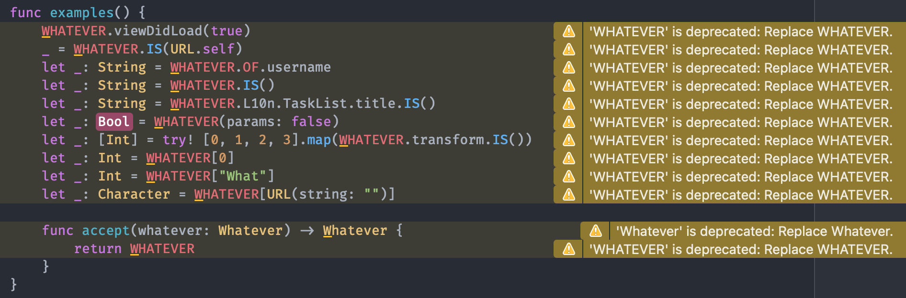

# Whatever

Whatever is a pacakge that offers you a placeholder when you are not sure what to type in code.



```swift
Whatever.viewDidLoad(animated)                                 // warning
userNameLabel.text = Whatever.OF.username                      // warning
let user = Whatever.IS(User.self)                              // warning
titleLabel.text = Whatever.L10n.TaskList.title.IS()            // warning
Whatever(someFunctionParamsForOtherFunction: false)            // warning
let _: [Int] = try! [0, 1, 2, 3].map(Whatever.transform.IS())  // warning, sad try is needed.
```

Using `Whatever` emits warnings, and will crash at run time.
